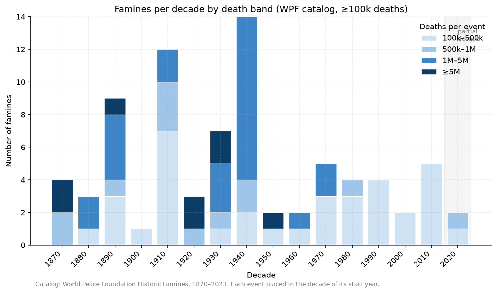
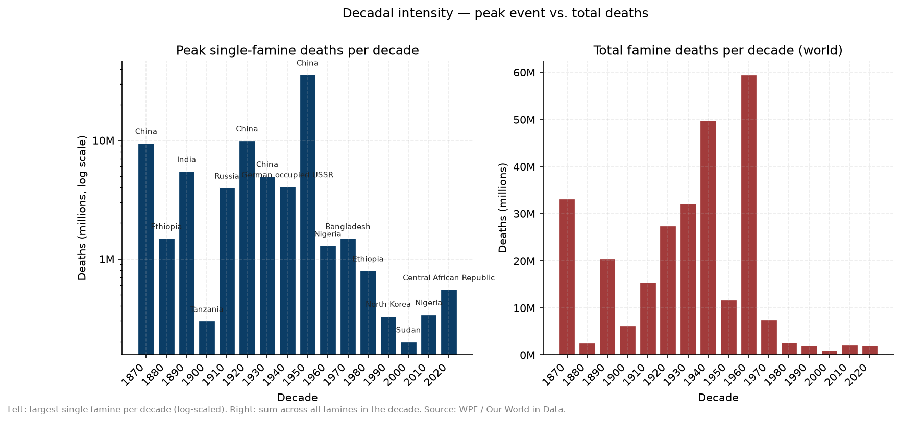
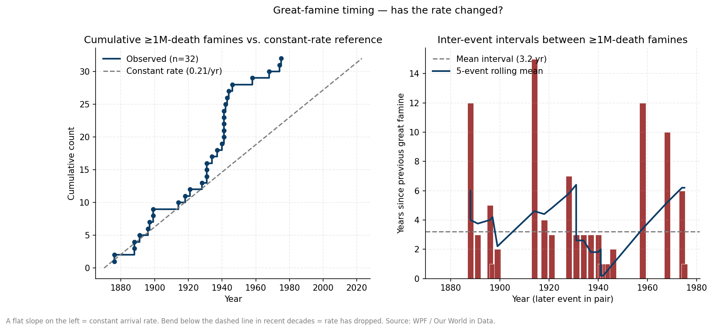
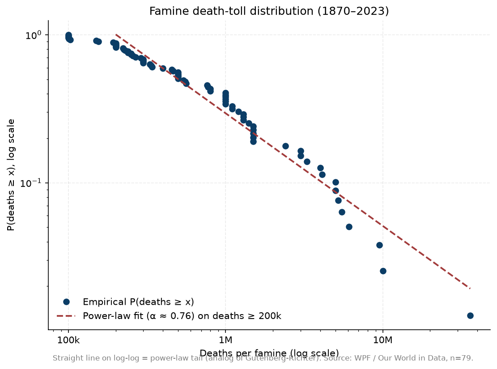

# famines-tracking

Data + analysis for tracking famines globally. One of 10 sibling repos analyzed together — see the [`correlations`](https://github.com/Biblejustin/correlations) hub for the cross-repo analysis.

## Quick findings

- **No ≥1M-death famine since Cambodia 1975–79.** Pre-1975 baseline was a great famine every ~3 years. The cumulative-vs-constant-rate plot is the cleanest summary.
- **The ≥1M and ≥5M severity bands disappear after 1960.** Recent decades still see 2–5 famines per decade, but in the 100k–500k range.
- **Death-toll distribution is fat-tailed power law (α ≈ 0.76).** Same statistical regime Cirillo & Taleb document for war casualties.

## Sample output

### Decadal counts by death band

Stacked bars: famines per decade by death band (100k–1M, 1M–5M, ≥5M). The 2020s decade is shaded grey because it's partial. The decadal distribution shows the disappearance of the ≥1M and ≥5M bands after 1960.

**In plain English:** Each bar shows how many famines started in that 10-year period, with the bar color split by how many people died. Big red sections (≥5M deaths) dominate the 1870s–1960s; modern decades have only the lower bands.

**Above vs. below the long-run mean:** Bars rising *above* the long-run decadal average (~5/decade) are busy famine periods (1870s with the Great Famine, 1900s, 1940s with the Bengal famine). Bars *below* the average (post-1960s except the 1990s) are quiet stretches.



### Decadal intensity

Two views: peak single-famine deaths per decade (left) and total deaths per decade (right).

**In plain English:** Left panel: how big was the single deadliest famine of each decade? Right panel: how many people died in famines total per decade? Both use log scales because famine death counts span orders of magnitude.

**Above vs. below the long-run trend:** The 1870s, 1900s, 1920s, 1940s, and 1958–62 bars rise high above any decadal average — those are the "great famine" decades. Post-1980 bars sit far below the long-run mean — confirming the "death-by-famine has collapsed" pattern visible in the catalog.



### Great-famine timing (≥1M deaths)

Cumulative ≥1M-death famine count over time vs a constant-rate reference + inter-event intervals.

**In plain English:** Left panel: the grey dashed line is "what we'd see if great famines hit at a steady ~3-year clock." The red staircase shows when they actually occurred. After the 1975 Cambodia famine the staircase goes flat — no new entries.

**Above vs. below the line:** When the staircase is *above* the grey reference, great famines have been arriving *faster* than the long-run average; *below* the line means *slower*. The catalog spent most of 1870–1965 tracking the reference closely, then crossed below in the late 20th C and has stayed below for 50 years — the post-1975 quiet stretch.



### Magnitude distribution

Log-log survival function with power-law fit on the ≥200k-death tail.

**In plain English:** Dots show "how many famines killed at least X people?" The dashed line through the right side shows the regular fat-tail pattern that connects "small common famines" to "rare huge ones."

**Above vs. below the line:** A dot *above* the dashed line means more famines at that death-count than the scaling rule predicts — an excess at that severity. A dot *below* the line means fewer than predicted. For famines, the very-large tail (≥10M deaths: the Great Famine, the Great Chinese Famine, Bengal, Soviet) sits roughly *on* the line — meaning the worst events in history are exactly what the scaling rule expects (not particularly anomalous given the catalog).



## Files

### Modern catalog (1870–2023)
- `famines-and-deaths.csv` — 78 individual famines ≥100k deaths. WPF/OWID.
- `deaths-by-region-year.csv` — annual deaths by region.
- `deaths-by-region-decade.csv` — decadal totals by region.
- `deaths-by-country-decade.csv` — decadal totals by country.
- `deaths-by-decade.csv` — global decadal **death rate** (per 100k population).
- `famines-and-deaths.metadata.json` — OWID metadata sidecar.

Source: World Peace Foundation (2025), *Historic Famines dataset*, via [Our World in Data](https://ourworldindata.org/famines). Only events ≥100k deaths.

### Historical pointer list (pre-1870)
- `historical_famines_pre1870.csv` — ~70 entries c. 2700 BC – 1868 AD. Hand-compiled from Wikipedia's *List of famines* (citing Ó Gráda, Davis, Jordan, Mallory, Bhatia, et al.), supplemented with Greco-Roman entries from Garnsey, *Famine and Food Supply in the Greco-Roman World* (1988), and biblical/Josephan references where externally attested.

Treat this as a research index, not a dataset:
- Pre-1500 mortality figures are orders of magnitude only.
- BC years are encoded as negative integers (`-587` = 587 BC).
- `source_tradition` names the primary source or scholarly catalog.
- Excluded from all statistical plots.

### Analysis
- `make_plots.py` — generates the four plots above.

## Reproducing the plots

```bash
uv venv .venv
uv pip install --python .venv/bin/python matplotlib pandas numpy
.venv/bin/python make_plots.py
```

## Analytical conventions

Adapted from a parallel earthquake-tracking project; transferable to other rare-event "signs" data (wars, pandemics).

- **Catalog regime constants.** WPF coverage starts 1870 at ≥100k deaths. Pre-1870 entries excluded from all statistical claims.
- **Partial-period handling.** 2020s bar in plot 02 shaded grey; not in trend fits.
- **Rolling/cumulative views for rare events.** Inter-event intervals and cumulative-vs-constant-rate sidestep calendar-bin noise.
- **Log-scaled severity.** Plot 05-left and plot 07 use log scales because death tolls span 10⁵ to 10⁷.
- **Power-law fit on the tail only.** Plot 07 fits the line on deaths ≥ 200k to avoid the catalog-completeness floor.

## Intended use

Data source for famine correlation tests in [`Biblejustin/correlations`](https://github.com/Biblejustin/correlations).

## Open work

- Population-normalized versions of plots 02 and 05 (need world-pop time series).
- Trailing-25-year sliding window (plot 04 analog).
- Add IPC Phase 5 person-month data for 2004–present to extend the modern series past raw mortality.
